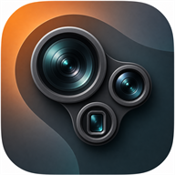
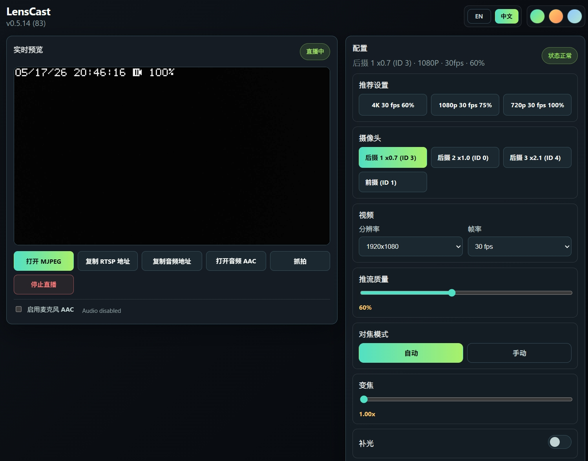
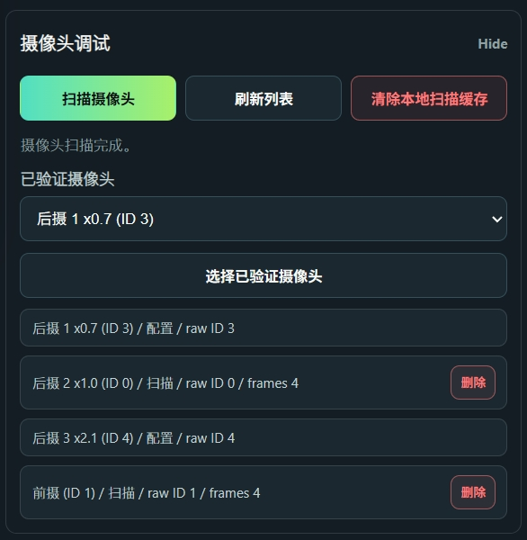
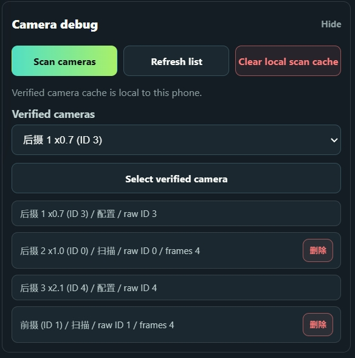

# LensCast

<p align="center">
  
</p>

<p align="center">
  <strong>把 Android 手机变成可调用多摄像头的本地网络摄像机。</strong>
</p>

<p align="center">
  <a href="#中文">中文</a> · <a href="#english">English</a> · <a href="https://github.com/AlexTOOT/LensCast/releases/tag/v0.5.14-83">下载 APK</a>
</p>

## 中文

LensCast 是一个 Android 本地网络摄像机应用。它的重点不是只把手机变成普通 IP Camera，而是尽可能调用手机上 Camera2 暴露出来的更多摄像头，包括主摄、广角、长焦 / 潜望长焦，以及部分厂商隐藏在普通相机选择器之外的物理摄像头。

适合的场景：

- 把旧手机作为本地监控摄像头
- 在浏览器或 NVR 中查看 MJPEG / RTSP 视频流
- 使用广角、长焦等非默认镜头
- 在视频左上角叠加时间、电量和充电状态
- 通过网页端远程调整分辨率、帧率、焦距、变焦、曝光和补光

## 界面预览

### Web 控制台



### 摄像头扫描



## 主要功能

- Camera2 摄像头扫描与本地已验证摄像头列表
- 支持主摄、广角、长焦等多摄像头选择
- Android 端控制界面
- Web 控制台
- MJPEG 视频流，适合浏览器和部分 NVR
- RTSP 视频流端点
- AAC 音频流
- 可保存当前帧的 Snapshot 端点
- 分辨率、帧率、推流质量、变焦、对焦、曝光、补光控制
- 可选视频叠加层：日期、时间、电量、充电状态
- 横屏直播模式与黑屏省电模式

## 使用说明

1. 在 Android 手机上安装 release 中的 APK。
2. 授予相机权限；如果需要音频，也授予麦克风权限。
3. 打开 LensCast，点击“扫描摄像头”。
4. 扫描完成后，在“已验证摄像头”中选择需要使用的镜头。
5. 选择预设或手动调整分辨率、帧率和推流质量。
6. 点击“开始直播”。
7. 在同一局域网内，用电脑或其它设备打开 App 中显示的 Web 地址。

默认端口：

- Web 控制台：`http://<phone-ip>:41737/`
- MJPEG：`http://<phone-ip>:41737/video.mjpeg`
- Snapshot：`http://<phone-ip>:41737/snapshot.jpg`
- AAC 音频：`http://<phone-ip>:41737/audio.aac`
- RTSP：`rtsp://<phone-ip>:8554/live`

## 摄像头扫描说明

Android 厂商对多摄像头的开放程度差异很大。LensCast 会扫描 Camera2 暴露出的摄像头 ID，并尝试识别可实际打开、可稳定出图的镜头。

建议首次使用时先执行一次扫描。扫描结果会缓存在本机，之后启动时可以直接加载。更换手机、系统更新、清除应用数据后，建议重新扫描。

如果某个镜头在扫描结果中出现，但实际直播失败，通常说明该镜头虽然被系统暴露，但厂商限制了第三方应用的实际使用能力。

## 构建

需要：

- Android Studio 或兼容 Android Gradle Plugin 的构建环境
- JDK 17
- Android SDK 34
- Gradle 8.7 或兼容版本

当前源码快照不包含本地 SDK 文件，也不包含 Gradle Wrapper。可以使用本机 Gradle 构建：

```powershell
gradle assembleDebug
```

当前 Android 包名：

```text
com.opencode.multilensipcam
```

## 注意事项

LensCast 面向本地局域网使用。不要在没有额外认证、反向代理或网络隔离的情况下，把 Web 控制台或视频流端点直接暴露到公网。

<details id="english">
<summary>English</summary>

## English

LensCast is a local Android network camera app focused on exposing more Camera2 camera devices than typical IP camera apps. On supported phones, it can use the main camera, ultra-wide camera, telephoto / periscope camera, and other physical camera IDs that are not normally available through simple front/back camera pickers.

Good use cases:

- Reuse an old Android phone as a local monitoring camera
- Watch MJPEG / RTSP streams in a browser or NVR
- Use ultra-wide or telephoto lenses instead of only the default camera
- Add a video overlay with date, time, battery level, and charging status
- Control resolution, frame rate, focus, zoom, exposure, and flashlight from the web UI

## Screenshots

### Web Dashboard


### Lens Scan



## Features

- Camera2 lens scanning and local verified camera list
- Main / ultra-wide / telephoto camera selection when available
- Native Android control panel
- Web dashboard
- MJPEG stream for browsers and some NVRs
- RTSP stream endpoint
- AAC audio stream
- Snapshot endpoint that saves the captured frame
- Resolution, frame rate, quality, zoom, focus, exposure, and flashlight controls
- Optional overlay with date, time, battery level, and charging state
- Landscape live mode and black-screen power saving mode

## Usage

1. Install the APK from the release page on an Android phone.
2. Grant camera permission. Grant microphone permission if audio is needed.
3. Open LensCast and tap Scan cameras.
4. Select a lens from the verified camera list.
5. Choose a preset or adjust resolution, frame rate, and stream quality manually.
6. Tap Start live.
7. Open the Web dashboard URL shown in the app from another device on the same LAN.

Default endpoints:

- Web dashboard: `http://<phone-ip>:41737/`
- MJPEG: `http://<phone-ip>:41737/video.mjpeg`
- Snapshot: `http://<phone-ip>:41737/snapshot.jpg`
- AAC audio: `http://<phone-ip>:41737/audio.aac`
- RTSP: `rtsp://<phone-ip>:8554/live`

## Camera Scanning

Android vendors expose multi-camera hardware differently. LensCast scans the Camera2 camera IDs and tries to identify lenses that can actually be opened and streamed reliably.

Run a scan the first time you use the app. The verified result is cached locally and loaded on later launches. Re-scan after switching phones, updating the system, or clearing app data.

If a lens appears during scanning but fails during live streaming, the phone may expose the camera ID while still restricting third-party access in practice.

## Build

Requirements:

- Android Studio or Android Gradle Plugin compatible toolchain
- JDK 17
- Android SDK 34
- Gradle 8.7 or compatible

This source snapshot does not include local SDK files or a Gradle wrapper. Build with your local Gradle installation:

```powershell
gradle assembleDebug
```

Current Android package name:

```text
com.opencode.multilensipcam
```

## Notes

LensCast is intended for local network use. Do not expose the web dashboard or stream endpoints directly to the public internet without adding your own authentication, reverse proxy, or network isolation.

</details>
